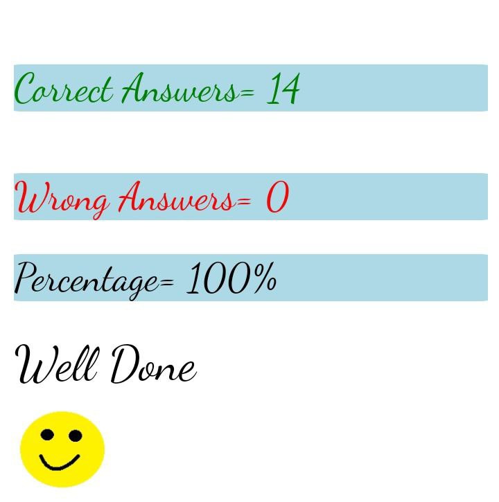

## 1) who is the founder of javascript and when?

## Ans: Brendan Eich in 1995

## 2) what is the first web browser? and when was it released?

## ans: The first web browser is world wide web. it was released in 1990.

## 3) Name the two dominant browsers in 2000

## ans: 1. Netscape navigator 2.Internet explorer.

## 4) what is ECMA script?

## ans: ECMA (europian computer manufactors association script) is a common language use to standardise the scripting.

## 5) Define syntax?

## ans: it is a grammatical arragement of language. it standardise the scripting.

## 6) what is TC39?

## ans: TC39 is technical committe standardise under ECMA international.

## 7) Name different datatypes in js?

## ans: primitive, non-primitive

## 8) Explain primitive and non-primitive data types?

## ans: int,float,string,boolean,undefined,null bigInt are examples of primitive data type. array,objects are examples of non-primitive data type.

## 9) Differentiate null and undefined?

## ans: undefined means a variable has been declared but has not yet been assigned a value. Null is an assignment value, meaning that a variable has been declared and given the value of null.

 ## 10)quiz
 
 