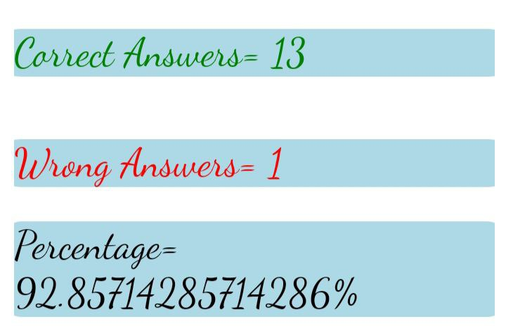

## Q1) what are the variable naming conventions in javascript?
## Ans: 
## - variables can be single character or multiple character or alphanumeric. 
## - spaces are not allowed in variable names.
## - names must begin with a letter.
## - variables are case sensitive.
## - only two symbols can use in varable name $(dollar symbol) and _(underscore)

## Q2) create a greeting alert(use=>prompt,message,alert)

## Ans: let name=prompt("enter yout name")
## alert("hi!" +name)

## Q3) write some code so that the values of the below variables switch around  
## let fish="fly",let bird="swim". switch the value so that fish hold the value "swim" and the variable bird holds the value "fly".
## Ans: let fish="fly"
## let bird="swim"
## c=bird
## bird=fish
## fish=c
## console.log(a)
## console.log(b)

## Q4) quiz

